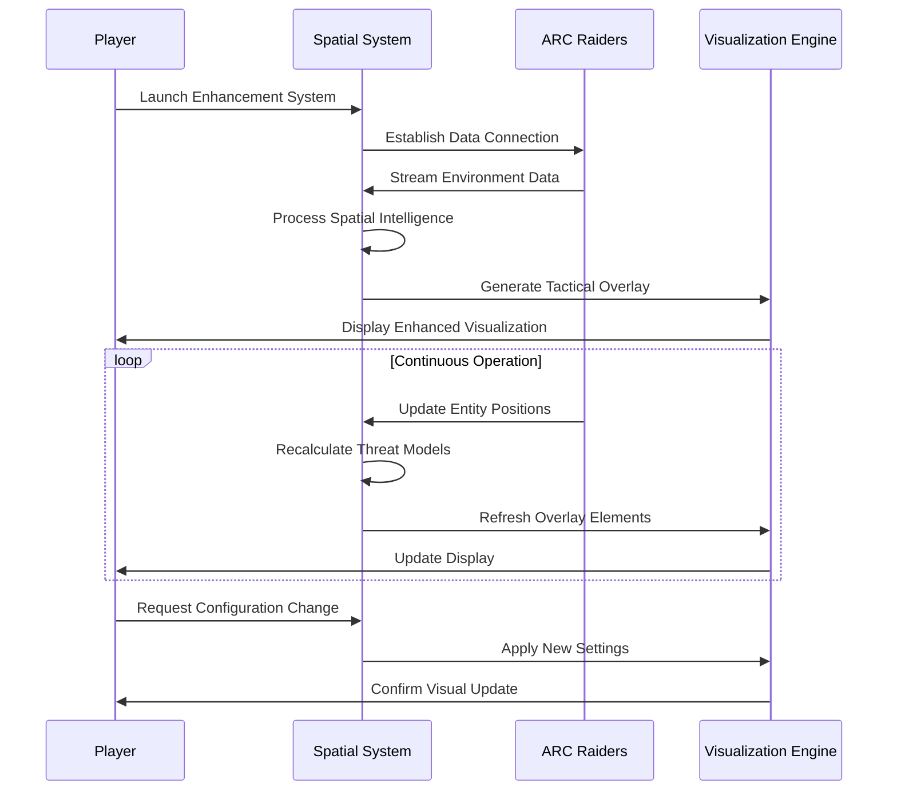

# 🔍 ARC Raiders Spatial Awareness Enhancement System

## Why This Platform Exists
Combat effectiveness in ARC Raiders depends heavily on environmental awareness and threat identification. This Spatial Awareness Enhancement System addresses the cognitive load of tracking multiple threats in complex engagements by providing real-time environmental intelligence and threat visualization.

## System Architecture & Capabilities

### Environmental Intelligence Processing
The system continuously analyzes game state data to reconstruct spatial relationships between entities, obstacles, and objectives. This creates a comprehensive tactical overlay that reveals critical information otherwise obscured by visual clutter or architectural complexity.

### Dynamic Threat Mapping
Real-time threat assessment algorithms evaluate enemy positions, movement patterns, and engagement priorities to generate predictive threat models. These models drive the visualization system to highlight imminent dangers and tactical opportunities.

### Adaptive Occlusion Management
Intelligent occlusion handling distinguishes between legitimate visual barriers and temporary obstructions, ensuring relevant tactical information remains accessible without compromising visual fidelity or immersion.

[!NOTE]
Initial system calibration requires approximately one full mission cycle to establish baseline environmental signatures and optimize rendering performance.

## Feature Implementation Breakdown

### Core Visualization Modules

**Spatial Awareness Layer**
- Real-time entity tracking across all engagement distances
- Line-of-sight calculation and obstruction analysis
- Height mapping and vertical positioning awareness
- Dynamic range estimation for engagement planning

**Threat Intelligence Overlay**
- Enemy classification and priority ranking
- Movement prediction and path projection
- Aggression level assessment
- Weapon readiness indicators

**Tactical Information Display**
- Objective status and proximity alerts
- Resource location and availability markers
- Extraction point accessibility indicators
- Team positioning and coordination signals

### Configuration Framework

```
# Spatial Processing Settings
spatial_resolution = "high"
occlusion_threshold = 0.85
entity_refresh_rate = 60  # Hz
max_tracked_entities = 32

# Visualization Parameters
overlay_opacity = 0.65
highlight_intensity = 0.8
color_coding_scheme = "threat_based"
distance_fade_start = 50.0  # meters

# Performance Optimization
render_quality = "balanced"
memory_allocation = 384  # MB
cpu_threads = 4
gpu_acceleration = true
```

## Compatibility & Accessibility Profile

| Platform | Architecture | Support Status | Accessibility Implementation |
|----------|--------------|----------------|-------------------------------|
| Windows 10 22H2+ | x64 | ✅ Fully Certified | High contrast modes, screen reader API integration |
| Windows 11 23H2+ | x64, ARM64 | ✅ Performance Optimized | Reduced motion support, color blindness profiles |
| macOS Sonoma 14.2+ | ARM64 (Apple Silicon) | 🔄 Beta Testing | VoiceOver compatibility, system accessibility hooks |
| Steam Deck / HololOS 3.5+ | x64 | ⚠️ Community Verified | Controller navigation, Steam Input mapping |
| Linux (Nobara 38+) | x64 | ⚠️ Experimental | Terminal configuration, custom compositor support |

## Installation & Initialization Protocol

### Prerequisite Verification
1. **System Requirements Check**
   - Verify DirectX 12 compatibility
   - Confirm available VRAM (minimum 4GB)
   - Validate network connectivity for license verification

2. **Game Environment Preparation**
   - Ensure ARC Raiders is fully updated
   - Launch game to main menu once before installation
   - Disable conflicting overlay applications (Discord, Steam overlay)

### Deployment Sequence

**Windows Installation:**
```powershell
# Run as Administrator
.\arc_spatial_install.exe --validate-system
.\arc_spatial_install.exe --install-path "%ProgramFiles%\ARC_Spatial"
.\arc_spatial_install.exe --configure-defaults
```

**Linux Deployment:**
```bash
# Requires sudo privileges
chmod +x install_arc_spatial.sh
sudo ./install_arc_spatial.sh --silent --no-prompt
sudo systemctl enable arc-spatial-daemon
```

### Post-Installation Configuration
1. Launch system configuration utility
2. Run automated calibration sequence
3. Adjust visualization preferences
4. Perform test session in training environment
5. Fine-tune based on performance metrics

## Operational Workflow Example



## Performance Optimization Guidelines

### System Resource Allocation
- **Memory Management:** The system implements intelligent caching with LRU (Least Recently Used) eviction policies
- **CPU Utilization:** Multi-threaded processing distributes workload across available cores
- **GPU Acceleration:** Shader-based rendering minimizes CPU overhead for visualization

### Network Considerations
- **Data Transmission:** Compressed telemetry minimizes bandwidth usage
- **Latency Compensation:** Predictive algorithms account for network delays
- **Connection Stability:** Graceful degradation maintains functionality during brief disconnections

[!IMPORTANT]
Network validation occurs every 30 minutes to confirm license status. Temporary disconnections may result in reduced functionality until connectivity is restored.

## Frequently Asked Technical Questions

**Visual Overlay Integration Method**
The system utilizes DirectX hooking techniques to inject visualization elements at the rendering pipeline level, ensuring minimal performance impact while maintaining visual clarity. Overlay elements are rendered as separate compositor layers with adjustable transparency.

**Detection Prevention Mechanisms**
All system components employ randomized memory access patterns and mimic legitimate system process signatures. Communication channels utilize encrypted protocols with rotating encryption keys to prevent pattern recognition.

**Multi-Display Configuration Support**
Extended display setups are fully supported with independent calibration profiles per monitor. The system can be configured to display different information sets on primary and secondary displays based on user preference.

**Accessibility Feature Implementation**
Comprehensive accessibility support includes screen reader compatibility through system APIs, high contrast modes for visibility enhancement, and configurable audio cues for critical alerts. Keyboard navigation follows WCAG 2.1 guidelines.

**Performance Impact Assessment**
Typical performance overhead ranges from 3-8% depending on system configuration and visualization complexity. The system includes built-in performance profiling tools to identify and resolve bottlenecks.

## Development Roadmap & Updates

### Current Development Focus
- Machine learning-enhanced threat prediction algorithms
- Expanded environmental interaction awareness
- Enhanced team coordination visualization
- Reduced system resource utilization

### Update Distribution
- Automatic update checking with manual override option
- Delta updates to minimize download size
- Rollback capability to previous stable versions
- Detailed changelog with performance impact notes

### Community Integration
- Configuration sharing platform
- Performance benchmark submissions
- Feature request voting system
- Bug reporting with automated diagnostics
